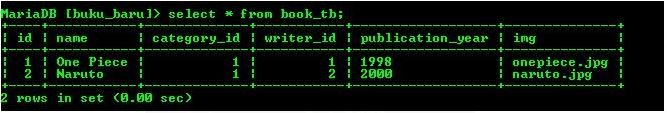
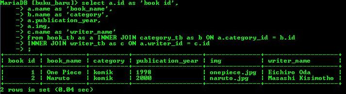
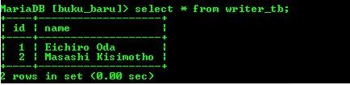

### DumbWays Bootcamp Test

Untuk file javascript 1 - 3, bisa dibuka / dicoba di https://playcode.io/

Untuk Soal 4 Querynya sebagai berikut :

1. Tampilkan seluruh data dari table book

2. Tampilkan seluruh data book, category dan penulis

3. Tampilkan selutuh data penulis

  
